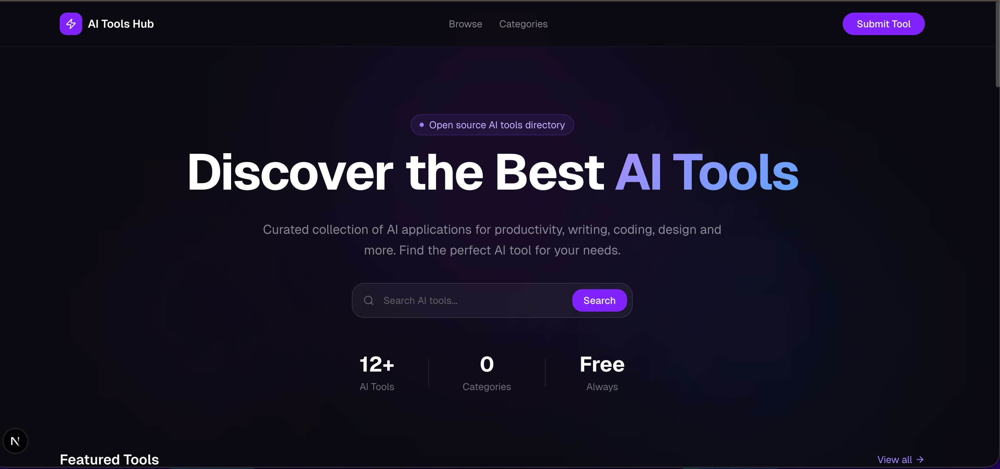
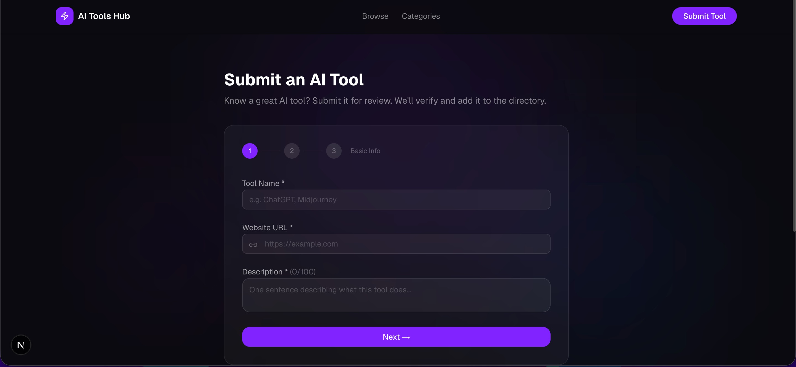
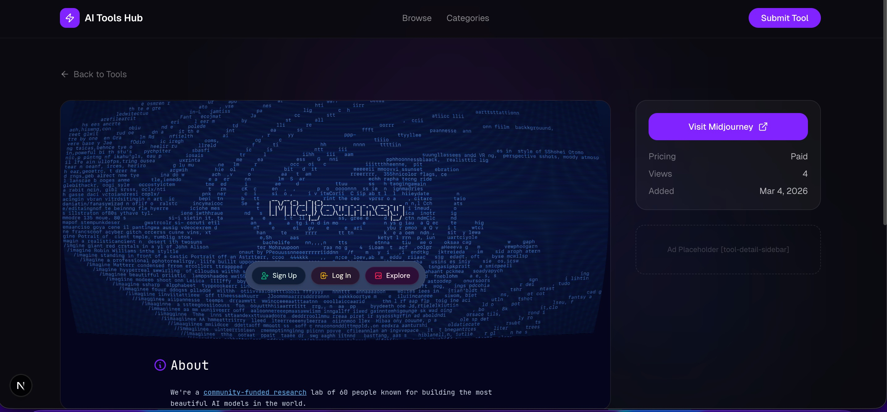

<div align="center">

# ⚡ AI Tools Hub

**The open source directory for discovering the best AI tools.**

[](https://opensource.org/licenses/MIT)
[](https://nextjs.org)
[](https://supabase.com)
[](https://vercel.com)

[**🌐 Live Demo**](https://aitoolshub.com) · [**Submit a Tool**](https://aitoolshub.com/submit) · [**Report Bug**](https://github.com/finvfamily/ai-tools-hub/issues)



</div>

---

## ✨ Features

- **Curated Directory** — Hand-reviewed AI tools across 10+ categories
- **Community Driven** — Anyone can submit a tool via web form or pull request
- **Instant Search** — Filter by name, category, and pricing model
- **Auto Screenshots** — Thumbnails auto-fetched via Microlink API
- **Fancy Dark UI** — Glassmorphism + Motion animations
- **SEO Ready** — Static generation, dynamic OG images, auto sitemap
- **Admin Dashboard** — One-click review and approval workflow
- **100% Open Source** — MIT licensed, fully self-hostable

---

## 📸 Screenshots

<table>
  <tr>
    <td width="33%"></td>
    <td width="33%"></td>
    <td width="33%"></td>
  </tr>
  <tr>
    <td align="center">Homepage</td>
    <td align="center">Submit a Tool</td>
    <td align="center">Tool Detail</td>
  </tr>
</table>

---

## 🤝 Submit a Tool

Know a great AI tool that's missing? Two ways to add it:

### Option 1 — Web Form _(for everyone)_
Visit [aitoolshub.com/submit](https://aitoolshub.com/submit), fill in the details, and we'll review it within 48 hours.

### Option 2 — Pull Request _(for developers)_
Open an issue titled `[Tool Submission] Tool Name` with the tool URL and a one-line description. We'll add it and credit you in the commit history.

> Every submission helps the community grow. Thank you! 🙌

---

## 🛠️ Tech Stack

| Layer | Technology |
|-------|-----------|
| Framework | [Next.js 15](https://nextjs.org) (App Router + TypeScript) |
| Styling | Tailwind CSS + [shadcn/ui](https://ui.shadcn.com) |
| Animation | [Motion](https://motion.dev) (Framer Motion v12) |
| Database | [Supabase](https://supabase.com) (PostgreSQL + RLS) |
| Screenshots | [Microlink API](https://microlink.io) |
| Deployment | [Vercel](https://vercel.com) |

---

## 🚀 Self-host in 5 Minutes

### Prerequisites
- Node.js 20+
- A free [Supabase](https://supabase.com) project

### 1. Clone & install

```bash
git clone https://github.com/finvfamily/ai-tools-hub.git
cd ai-tools-hub
npm install
```

### 2. Configure environment

```bash
cp .env.local.example .env.local
```

```env
NEXT_PUBLIC_SUPABASE_URL=https://your-project.supabase.co
NEXT_PUBLIC_SUPABASE_ANON_KEY=your_anon_key
SUPABASE_SERVICE_ROLE_KEY=your_service_role_key
NEXT_PUBLIC_SITE_URL=http://localhost:3000
```

> **Where to find these?**
> Supabase Dashboard → Settings → API → copy Project URL and keys.

### 3. Set up the database

In your **Supabase SQL Editor**, run the full contents of [`supabase/schema.sql`](./supabase/schema.sql).

This creates all tables, indexes, RLS policies, and seeds 10 initial categories.

### 4. Create an admin account

Supabase Dashboard → Authentication → Users → **Add user**

Use this account to log in at `/admin/login`.

### 5. Start the dev server

```bash
npm run dev
```

Open [http://localhost:3000](http://localhost:3000) 🎉

### Available Routes

| Route | Description |
|-------|-------------|
| `/` | Homepage |
| `/tools` | Browse & filter all tools |
| `/tools/[slug]` | Tool detail page |
| `/submit` | Submit a tool |
| `/admin/login` | Admin login |
| `/admin` | Review dashboard |

### 6. Deploy to Vercel

[](https://vercel.com/new/clone?repository-url=https://github.com/finvfamily/ai-tools-hub)

Add the same environment variables in Vercel project settings, and you're live.

---

## 📁 Project Structure

```
src/
├── app/
│   ├── (site)/           # Public pages
│   │   ├── page.tsx      # Homepage
│   │   ├── tools/        # Tool list & detail
│   │   └── submit/       # Submission form
│   ├── (admin)/          # Auth-protected admin
│   └── api/              # API routes (submit, OG image)
├── components/           # UI components
├── lib/
│   ├── supabase/         # Server & client Supabase clients
│   └── queries/          # DB query functions
└── types/                # TypeScript definitions
```

---

## 🗄️ Database Schema

Five tables: `categories` · `tags` · `tools` · `tool_tags` · `submissions`

See [`supabase/schema.sql`](./supabase/schema.sql) for the complete schema.

**Key decisions:**
- All submissions start as `pending` — require admin approval before going live
- RLS ensures public users only read `approved` tools
- `submissions` table provides a full audit trail

---

## 🤖 Tool Categories

| | Category | Slug |
|-|----------|------|
| ✍️ | Writing & Content | `writing` |
| 🎨 | Image & Design | `image` |
| 💻 | Code & Dev | `code` |
| ⚡ | Productivity | `productivity` |
| 🎬 | Video & Audio | `video` |
| 📊 | Data & Analytics | `data` |
| 📣 | Marketing | `marketing` |
| 📚 | Education | `education` |
| 🔍 | Research | `research` |
| 🤖 | Other | `other` |

---

## 🙌 Contributing

All contributions are welcome!

- **Submit an AI tool** → [Use the web form](https://aitoolshub.com/submit) or open an issue
- **Fix a bug** → Fork, fix, open a PR
- **Improve the UI** → Fork, tweak, open a PR
- **Suggest a category** → Open a discussion

Please keep PRs small and focused — one fix or feature per PR.

---

## 📄 License

[MIT](./LICENSE) — free to use, modify, and self-host.

If this project helps you, a ⭐ on GitHub means a lot!

---

<div align="center">

[⭐ Star this repo](https://github.com/finvfamily/ai-tools-hub) · [🐛 Report Bug](https://github.com/finvfamily/ai-tools-hub/issues) · [💡 Suggest Feature](https://github.com/finvfamily/ai-tools-hub/issues)

</div>
